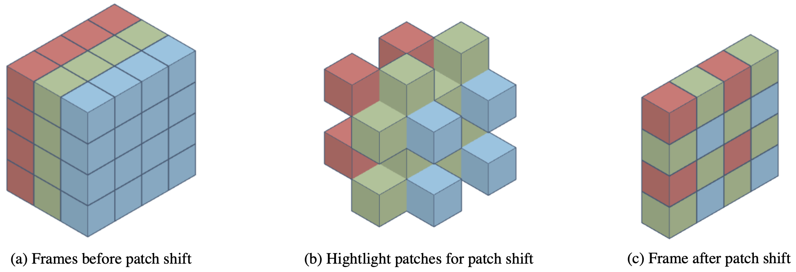

# TPS: Spatiotemporal Self-attention Modeling with Temporal Patch Shift for Action Recognition

This repo is the official implementation of ["TPS"](https://arxiv.org/abs/2207.13259). It is based on [Video Swin](https://github.com/SwinTransformer/Video-Swin-Transformer).

TPS is now available at ["ModelScope"](https://modelscope.cn/models/damo/cv_pathshift_action-recognition/summary)

## Introduction

**TPS** Transformer-based methods have recently achieved great advancement on 2D image-based vision tasks. For 3D video-based tasks such as action recognition, however, directly applying spatiotemporal transformers on video data will bring heavy computation and memory burdens due to the largely increased number of patches and the quadratic complexity of self-attention computation. How to efficiently and effectively model the 3D self-attention of video data has been a great challenge for transformers. In this paper, we propose a Temporal Patch Shift (TPS) method for efficient 3D self-attention modeling in transformers for video-based action recognition. TPS shifts part of patches with a specific mosaic pattern in the temporal dimension, thus converting a vanilla spatial self-attention operation to a spatiotemporal one with little additional cost. As a result, we can compute 3D self-attention using nearly the same computation and memory cost as 2D self-attention. TPS is a plug-and-play module and can be inserted into existing 2D transformer models to enhance spatiotemporal feature learning. The proposed method achieves competitive performance with state-of-the-arts on Something-something V1 & V2, Diving-48, and Kinetics400 while being much more efficient on computation and memory cost.





**Notes**:

- **Pre-trained image models can be downloaded from [Swin Transformer for ImageNet Classification](https://github.com/microsoft/Swin-Transformer)**.
- The pre-trained model of SSv2 could be downloaded at [github](https://github.com/SwinTransformer/storage/releases/download/v1.0.4/swin_base_patch244_window1677_kinetics400_22k.pth)/[baidu](https://pan.baidu.com/s/1ZnJuX7-x2BflDKHpuvdLUg).
- Access code for baidu is `swin`.

## Usage

Please follow Video Swin for installation and data preparation.

###  Installation

Please refer to [install.md](docs/install.md) for installation.

We also provide docker file [cuda10.1](docker/docker_10.1) ([image url](https://hub.docker.com/layers/ninja0/mmdet/pytorch1.7.1-py37-cuda10.1-openmpi-mmcv1.3.3-apex-timm/images/sha256-06d745934cb255e7fdf4fa55c47b192c81107414dfb3d0bc87481ace50faf90b?context=repo)) and [cuda11.0](docker/docker_11.0) ([image url](https://hub.docker.com/layers/ninja0/mmdet/pytorch1.7.1-py37-cuda11.0-openmpi-mmcv1.3.3-apex-timm/images/sha256-79ec3ec5796ca154a66d85c50af5fa870fcbc48357c35ee8b612519512f92828?context=repo)) for convenient usage.

###  Data Preparation

Please refer to [data_preparation.md](docs/data_preparation.md) for a general knowledge of data preparation.
The supported datasets are listed in [supported_datasets.md](docs/supported_datasets.md).

We also share our Kinetics-400 annotation file [k400_val](https://github.com/SwinTransformer/storage/releases/download/v1.0.6/k400_val.txt), [k400_train](https://github.com/SwinTransformer/storage/releases/download/v1.0.6/k400_train.txt) for better comparison.

### Inference
```
# single-gpu testing
python tools/test.py <CONFIG_FILE> <CHECKPOINT_FILE> --eval top_k_accuracy

# multi-gpu testing
bash tools/dist_test.sh <CONFIG_FILE> <CHECKPOINT_FILE> <GPU_NUM> --eval top_k_accuracy
```

### Training

To train a video recognition model with pre-trained image models (for Kinetics-400 and Kineticc-600 datasets), run:
```
# single-gpu training
python tools/train.py <CONFIG_FILE> --cfg-options model.backbone.pretrained=<PRETRAIN_MODEL> [model.backbone.use_checkpoint=True] [other optional arguments]

# multi-gpu training
bash tools/dist_train.sh <CONFIG_FILE> <GPU_NUM> --cfg-options model.backbone.pretrained=<PRETRAIN_MODEL> [model.backbone.use_checkpoint=True] [other optional arguments]
```
For example, to train a `Swin-T TPS` model for Kinetics-400 dataset  with  8 gpus, run:
```
bash tools/dist_train.sh configs/recognition/tps/swin_tiny_2D_patch244_tps_k400_1k.py 8 --cfg-options model.backbone.pretrained=<PRETRAIN_MODEL> 
```

To train a video recognizer with pre-trained video models (for Something-Something v1/v2 datasets), run:
```
# single-gpu training
python tools/train.py <CONFIG_FILE> --cfg-options load_from=<PRETRAIN_MODEL> [model.backbone.use_checkpoint=True] [other optional arguments]

# multi-gpu training
bash tools/dist_train.sh <CONFIG_FILE> <GPU_NUM> --cfg-options load_from=<PRETRAIN_MODEL> [model.backbone.use_checkpoint=True] [other optional arguments]
```
For example, to train a `Swin-T TPS` model for SSv2 dataset with 8 gpus, run:
```
bash tools/dist_train.sh configs/recognition/tps/swin_tiny_2D_patch244_tps_sthv2_1k.py 8 --cfg-options load_from=<PRETRAIN_MODEL>
```

**Note:** `use_checkpoint` is used to save GPU memory. Please refer to [this page](https://pytorch.org/docs/stable/checkpoint.html) for more details.


### Apex (optional):
We use apex for mixed precision training by default. To install apex, use our provided docker or run:
```
git clone https://github.com/NVIDIA/apex
cd apex
pip install -v --disable-pip-version-check --no-cache-dir --global-option="--cpp_ext" --global-option="--cuda_ext" ./
```
If you would like to disable apex, comment out the following code block in the [configuration files](configs/recognition/swin):
```
# do not use mmcv version fp16
fp16 = None
optimizer_config = dict(
    type="DistOptimizerHook",
    update_interval=1,
    grad_clip=None,
    coalesce=True,
    bucket_size_mb=-1,
    use_fp16=True,
)
```

## Citation
If you find our work useful in your research, please cite:

```
@article{xiang2022tps,
  title={Spatiotemporal Self-attention Modeling with Temporal Patch Shift for Action Recognition},
  author={Wangmeng Xiang, Chao Li, Biao Wang, Xihan Wei, Xian-Sheng Hua, Lei Zhang},
  journal={Proceedings of the European Conference on Computer Vision},
  year={2022}
}
```
